# Báo cáo tiến độ nghiên cứu đề tài lớp ESP32 D23 - Thiết kế bộ điều khiển và thuật toán điều khiển cho hệ thống Drone 

## A) Công việc đã làm
- Tìm hiểu động học Drone
- Vẽ sơ đồ tổng quan hệ thống 
- Tìm hiểu Free RTOS
1) Động học Drone 
1.1) Nguyên lý hoạt động 
- Drone hoạt động dựa trên việc kiểm soát lực nâng từ bốn động cơ BLDC. Mỗi động cơ được gắn với một cánh quạt, và khi quay sẽ tạo ra lực nâng hướng lên. Khi tổng lực nâng của 4 động cơ lớn hơn trọng lực, drone sẽ bay lên. Nếu bằng trọng lực, drone sẽ lơ lửng; nếu nhỏ hơn, drone sẽ hạ xuống.

- Moment quay (Torque)

Khi một động cơ quay, ngoài việc tạo ra lực nâng hướng lên, nó còn tạo ra moment xoắn (moment quay) quanh trục Z (trục thẳng đứng). Moment xoắn này sinh ra do phản lực của không khí khi cánh quạt quay, tuân theo định luật bảo toàn moment động lượng.

Nếu tất cả các động cơ đều quay theo cùng một chiều (ví dụ: cùng quay thuận chiều kim đồng hồ), tổng moment xoắn sẽ không bị triệt tiêu. Khi đó, toàn bộ drone sẽ bị xoay tròn quanh trục Z một cách không kiểm soát (hiện tượng này gọi là "yaw drift").
Để giữ cho drone không bị xoay vòng (yaw), hai động cơ quay theo chiều kim đồng hồ (CW), hai động cơ quay ngược chiều kim đồng hồ (CCW), nhằm triệ ttiêu moment xoắn.

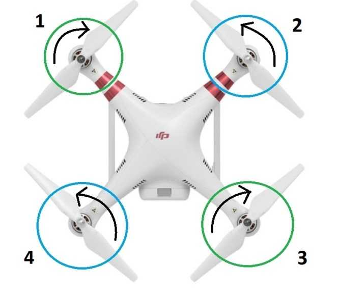

- **Điều khiển độ cao Drone** :

    Lực nâng các cánh quạt bằng nhau: 

    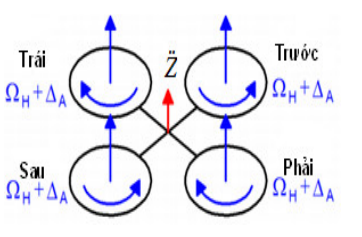 

- **Điều khiển trục roll . pitch (nghiêng)** :
    Lực nâng của 2 cánh cùng phía sẽ nhỏ hơn hoặc lớn hơn phía còn lại :

    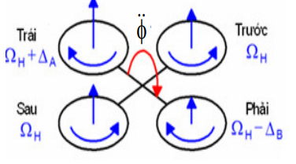

- **Điều khiển trục Yaw (xuay theo trục Oz)**:
   Lực nâng 2 động cơ chéo nhau sẽ lớn hoặc nhỏ hơn 2 động cơ chéo còn lại.

    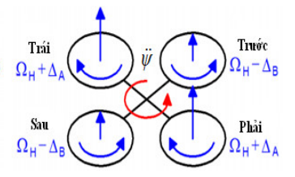

1.2) Lực nâng
- Cấu tạo khí động học của cánh quạt Drone:
Cánh quạt Drone cũng như mọi thiết bị bay sử dụng cánh quạt đề có cấu tạo đặc biệt để có thể tạo được lực nâng. Như hình ta có thể thấy cánh quạt sẽ làm phân chia 2 vùng áp suất không khí là mặt trên và dưới cánh, lượng không khí đi qua mặt dưới sẽ lớn hơn lượn không khí đi qua mặt trên. Người ta đã ứng dụng định luật Bernouli cho hiện tượng này và ứng dụng chúng trong thực tế về Drone cũng như các thiết bị hàng không nói chung.
    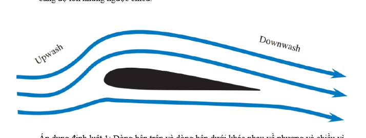
- Định luật Bernouli: " Trong dòng chất lưu (không khí, nước...) lý tưởng, nếu tốc độ dòng chảy tăng thì áp suất tĩnh giảm, và ngược lại ".
- Lực sinh ra do chênh lệch áp suất không khí giữa mặt dưới mà mặt trên của cánh quạt khi động cơ quay.  

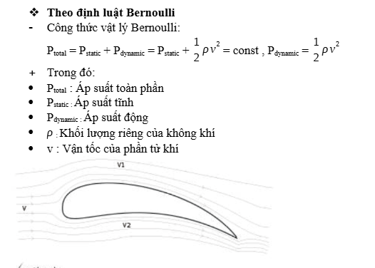

- Từ công thức trên ta thấy: Áp suất tổng là không đổi (bằng hằng số). Vận tốc lớn hơn thì áp suất động lớn hơn dẫn tới áp suất tĩnh nhỏ hơn và ngược lại. Do vậy mà áp suất tĩnh bề mặt phía trên sẽ nhỏ hơn áp suất tĩnh bề mặt phía dưới. Chính sự chênh lệch áp suất tĩnh này tạo nên lực nâng cho cánh Drone khi động cơ quay. Và khi vận tốc quay càng nhanh dẫn tới vận tốc không khí đi qua bề mặt cành lớn thì lực nâng càng tăng. 

2) Sơ đồ tổng quan hệ thống
- Hệ thống bao gồm các thành phần:
    - 4 động cơ BLDC ( Brush Less DC )
    - 4 ESC ( Electronic Speed Controller)
    - 1 ESP32 WROOM 32 
    - 1 MPU9250 + BMP280 ( Cảm biến gia tốc, áp suất, nhiệt độ,...)
    - 1 bộ chuyển đổi điện áp
    - 1 nguồn DC 
- Sơ đồ tổng quan :

    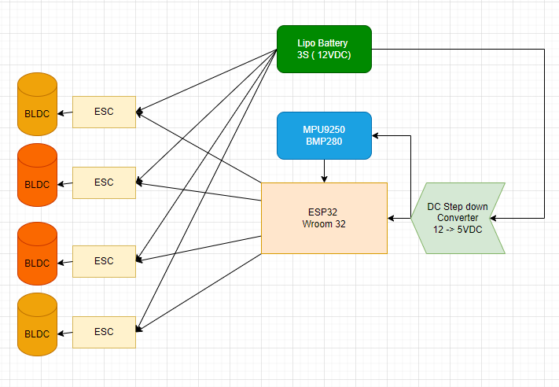

2.1) Động cơ BLDC 
- Có tên gọi phổ biến là " Động cơ không chổi than ", có cuộn dây và phần cố định ( Stato ) và phần quay là nam châm gắn bên trong vỏ quay (Roto). Vì không có chổi than nên hạn chế tối đa được lực ma sát giữa các mặt tiếp xúc.          

    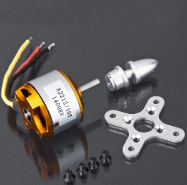

- Ưu điểm:
    - Không có ma sát chổi than -> ít mài mòn, tuổi thọ cao.
    - Hiệu suất cao hơn (ít hao tổn cơ học, tản nhiệt tốt).
    - Tốc độ quay cao, mượt và êm.
    - Điều khiển chính xác hơn (nhờ cảm biến vị trí hoặc điều chế điện tử).
    - Ít nhiễu điện từ hơn -> dùng tốt trong drone, robot, thiết bị y tế...

- Nhược điểm:
    - Giá cao hơn brushed motor.
    - Cần mạch điều khiển (ESC) để chạy nên sẽ phức tạp hơn khi lập trình.
    - Khó điều khiển trực tiếp nếu không có driver/phần mềm hỗ trợ.
2.2) ESC ( Electronic Speed Controller )
- Còn được gọi là " Bộ điều tốc".

    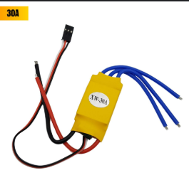

**Chức năng chính:**
- Nhận tín hiệu điều khiển từ vi điều khiển hoặc bộ thu sóng.
- Chuyển đổi tín hiệu thành dòng điện phù hợp để điều chỉnh tốc độ động cơ.
- Đảm bảo động cơ quay mượt mà, chính xác.

**Nguyên lý hoạt động:**
- Sử dụng kỹ thuật điều chế độ rộng xung (PWM) để kiểm soát lượng điện năng cấp cho động cơ.
- Đối với động cơ BLDC, ESC thực hiện chuyển mạch điện tử để động cơ quay hiệu quả.

**Ứng dụng:**
- Drone/quadcopter
- Xe mô hình, robot tự động
2.3) ESP32 WROOM 32
- Là vi điều khiển chính của hệ thống, tích hợp WiFi và Bluetooth, có khả năng xử lý mạnh mẽ.
- Được dùng để thu thập dữ liệu từ cảm biến, xử lý tín hiệu, điều khiển ESC và giao tiếp với các thiết bị ngoại vi.

    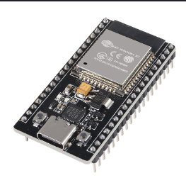

- Ưu điểm:
    - Giá thành rẻ, dễ lập trình.
    - Hỗ trợ nhiều giao thức truyền thông (UART, SPI, I2C...).
    - Có thể kết nối không dây với máy tính hoặc điện thoại để giám sát và điều khiển.

- Nhược điểm:
    - Công suất xử lý có giới hạn so với các vi xử lý chuyên dụng.
    - Cần nguồn điện ổn định để hoạt động tốt.
2.4) MPU9250 + BMP280
- **MPU9250:** Cảm biến 9 trục gồm gia tốc kế, con quay hồi chuyển và từ kế, giúp xác định vị trí, hướng và chuyển động của drone.
- **BMP280:** Cảm biến áp suất và nhiệt độ, dùng để đo độ cao và điều kiện môi trường.

    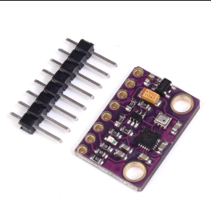

- Ưu điểm:
    - Đo được nhiều thông số vật lý cần thiết cho điều khiển bay.
    - Kích thước nhỏ gọn, dễ tích hợp.

- Nhược điểm:
    - Độ chính xác phụ thuộc vào hiệu chuẩn.
    - Có thể bị nhiễu nếu lắp đặt không đúng kỹ thuật.
2.5) Bộ chuyển đổi điện áp
- Thiết bị chuyển đổi nguồn điện từ pin/nguồn DC sang mức điện áp phù hợp cho các linh kiện (ví dụ: 5V, 3.3V).
- Đảm bảo các thành phần hoạt động ổn định, tránh hỏng hóc do quá áp hoặc sụt áp.

    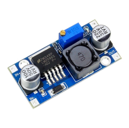

- Ưu điểm:
    - Bảo vệ linh kiện khỏi hư hỏng do điện áp không phù hợp.
    - Dễ dàng tích hợp vào hệ thống.

- Nhược điểm:
    - Nếu chất lượng kém có thể gây nhiễu hoặc sụt áp.

2.6) Nguồn DC
- Cung cấp năng lượng cho toàn bộ hệ thống drone, thường là pin LiPo hoặc nguồn DC ngoài. Trong dự án này sử dụng Pin Lipo 3S ( ~ 12VDC)
- Đảm bảo đủ dòng và điện áp cho động cơ, vi điều khiển và các cảm biến.

    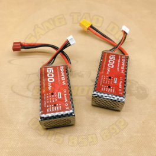

- Ưu điểm:
    - Dễ thay thế, sạc lại được.
    - Đáp ứng nhu cầu năng lượng cao của drone.

- Nhược điểm:
    - Hết pin sẽ phải dừng hoạt động để sạc hoặc thay thế.
    - Cần quản lý pin cẩn thận để tránh cháy nổ.

3) Free RTOS ( Real Time Operating System )
- **FreeRTOS** là một hệ điều hành thời gian thực mã nguồn mở, được thiết kế tối ưu cho các vi điều khiển và hệ thống nhúng. FreeRTOS cung cấp môi trường đa nhiệm, cho phép nhiều tác vụ (task) chạy song song, quản lý tài nguyên hệ thống hiệu quả và đảm bảo các tác vụ quan trọng được xử lý đúng thời điểm.

    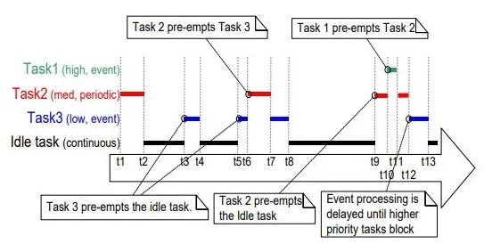

**Đặc điểm nổi bật:**
- Quản lý đa nhiệm (multitasking) với khả năng ưu tiên các tác vụ theo mức độ quan trọng.
- Hỗ trợ các cơ chế đồng bộ hóa như semaphore, mutex, queue giúp các thành phần trong hệ thống giao tiếp và phối hợp an toàn.
- Tiêu tốn ít tài nguyên bộ nhớ, phù hợp với các vi điều khiển như ESP32.
- Dễ dàng mở rộng, tích hợp với các thư viện phần cứng và phần mềm khác.

**Ứng dụng trong hệ thống drone:**

Trong hệ thống drone gồm các thành phần như động cơ BLDC, ESC, ESP32, cảm biến MPU9250 + BMP280, bộ chuyển đổi điện áp và nguồn DC, FreeRTOS đóng vai trò trung tâm trong việc điều phối hoạt động của toàn bộ hệ thống:

- **Điều khiển động cơ BLDC qua ESC:** FreeRTOS cho phép tạo các task riêng biệt để điều khiển từng động cơ, đảm bảo phản hồi nhanh và ổn định khi nhận lệnh từ bộ điều khiển trung tâm.
- **Đọc và xử lý dữ liệu cảm biến:** Các task đọc dữ liệu từ MPU9250 và BMP280 có thể chạy song song, liên tục cập nhật trạng thái vị trí, độ cao, nhiệt độ, giúp drone bay ổn định và an toàn.
- **Xử lý tín hiệu và truyền thông:** FreeRTOS hỗ trợ các task giao tiếp giữa ESP32 với máy tính, điện thoại hoặc các thiết bị ngoại vi qua WiFi/Bluetooth mà không làm gián đoạn các nhiệm vụ điều khiển bay.
- **Quản lý nguồn điện:** Có thể tạo các task giám sát điện áp, cảnh báo khi pin yếu hoặc quá nhiệt, giúp bảo vệ hệ thống khỏi các sự cố về nguồn.
- **Điều khiển PID:** FreeRTOS giúp triển khai thuật toán PID cho từng động cơ hoặc trục bay, đảm bảo drone giữ cân bằng và thực hiện các chuyển động chính xác.

**Lợi ích khi sử dụng FreeRTOS cho drone:**
- Tăng độ tin cậy và ổn định của hệ thống điều khiển bay.
- Đảm bảo các tác vụ quan trọng luôn được ưu tiên xử lý.
- Dễ dàng mở rộng, tích hợp thêm các chức năng mới mà không ảnh hưởng đến các phần đã hoạt động ổn định.
- Giảm độ trễ trong xử lý tín hiệu, nâng cao hiệu suất và khả năng phản ứng của drone với môi trường thực tế.
## B) Công việc tiếp theo
- Nghiên cứu sâu về động học và động lực học của Drone ( cái này củ chuối quá nên em chưa tìm hiểu được sâu ạ :< )
- Bộ điều khiển PID trong Drone
- Tìm hiểu thêm về Free RTOS
## C) Khó khăn
- Để đọc được cảm biến gia tốc góc, áp suất, MPU9250 + BMP280 cần phải có bộ lọc tín hiệu ví dụ như Kanmal filter, Complementary  Fillter , tuy nhiên em học xử lí tín hiệu hơi đơ nên chưa biết ứng dụng mấy cái này vô code như nào ạ.
