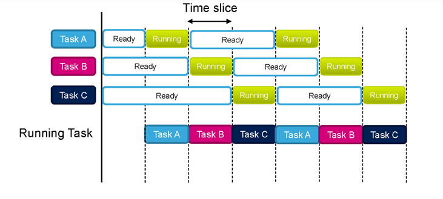
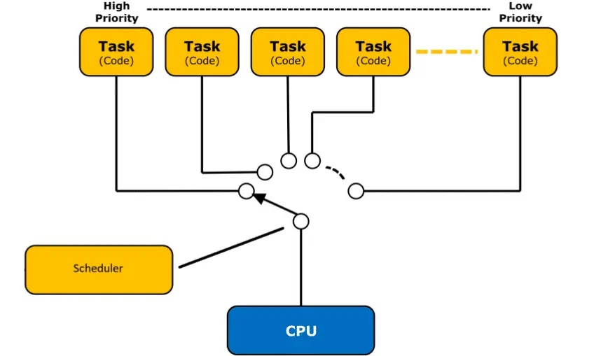

# Báo cáo tổng kết đề tài nghiên cứu ESP32 
## Thiết kế hệ thống Drone sử dụng ESP32 và hệ điều hành thời gian thực (RTOS)
1. Hệ điều hành RTOS là gì ? Tại sao lại sử dụng 
- RTOS (Real-Time Operating System) là hệ điều hành chuyên dụng cho các hệ thống nhúng và IoT, được thiết kế để xử lý các tác vụ trong thời gian thực.

    

    
- So sánh giữa RTOS và Loop thông thường 
    + Phương thức hoạt động : 
        - RTOS bản chất vẫn chạy lần lượt qua các tác vụ, tuy nhiên chỉ chạy với thời gian cho phép , nếu quá thời gian thì chuyển qua tác vụ khác , tránh làm mất thời gian hoạt động của các tác vụ khác, các task được thực thi liên tục, nhanh tới mức gần như hoạt động song song cùng 1 lúc -> hoạt động các task sẽ được ấn định theo thời gian thực mà ko phụ thuộc và yếu tố khác như delay từ các tác vụ trước

        
        
        - Vòng loop thông thường : chạy từ trên xuống và tiếp tục vòng tuần hoàn lặp lại , với lợi thế là đơn giản, dễ hiểu , phù hợp cho dự án nhỏ ít tác vụ, nhưng sẽ khó quản lí nếu mở rộng project. 
- Ví dụ thực tiễn:

    - Trong Drone, khi cảm biến con quay hồi chuyển (Gyroscope) phát hiện drone bị nghiêng, bộ điều khiển phải tính toán PID và điều chỉnh tốc độ động cơ ngay lập tức. Nếu trễ chỉ 50–100 ms, drone có thể mất cân bằng và rơi.

    - Nếu chỉ dùng vòng lặp loop() tuần tự trong Arduino, khi chương trình đang bận xử lý WiFi thì việc đọc cảm biến bị trì hoãn → không đảm bảo an toàn.

    - Với RTOS, mỗi tác vụ (task) được chạy song song, có mức ưu tiên khác nhau. Task quan trọng (điều khiển động cơ) luôn được xử lý trước, task ít quan trọng (gửi dữ liệu telemetry) có thể chờ.
2. Các tính năng mà RTOS cung cấp ? 
Một số tính năng chính của FreeRTOS (hệ điều hành được tích hợp sẵn trong ESP32):

- Task Scheduling (Lập lịch tác vụ):

    

    Cho phép tạo nhiều task (giống như nhiều vòng loop() độc lập).
    - Ví dụ:

        - Task 1: Đọc cảm biến IMU mỗi 10 ms.

        - Task 2: Tính toán PID và điều khiển động cơ.

        - Task 3: Gửi dữ liệu telemetry qua WiFi mỗi 200 ms.

- Semaphore và Mutex (Đồng bộ tài nguyên):

    Ngăn chặn xung đột khi nhiều task cùng truy cập một thiết bị.
    -  Ví dụ: Một task đọc dữ liệu từ cảm biến I2C trong khi task khác cũng muốn gửi dữ liệu qua I2C -> Mutex giúp “khóa” bus I2C để tránh lỗi.

- Queue (Hàng đợi):

    Dùng để truyền dữ liệu giữa các task.
    -  Ví dụ: Task đọc cảm biến gửi dữ liệu vào hàng đợi, Task điều khiển sẽ lấy dữ liệu từ hàng đợi để tính toán PID.

- Timer Service (Bộ đếm thời gian):

    Thực hiện một hàm lặp lại theo chu kỳ cố định.
    - Ví dụ: Mỗi 1000 ms kiểm tra điện áp pin, nếu pin yếu thì hạ độ cao và hạ cánh.

- Event Group:

    Cho phép nhiều task đồng bộ theo sự kiện.
    - Ví dụ: Drone chỉ cất cánh khi cảm biến GPS đã định vị và pin đủ dung lượng.
3. Trong dự án sử dụng RTOS thế nào ? 
- Hệ thống Drone có thể phân chia thành các task chính:

    - Task đọc cảm biến (Sensor Task):

        - Đọc dữ liệu từ IMU (gia tốc, gyroscope), GPS, cảm biến khoảng cách.

    - Task điều khiển động cơ (Control Task):

        - Tính toán PID dựa trên dữ liệu từ Sensor Task.

        - Gửi tín hiệu PWM đến ESC để điều chỉnh tốc độ động cơ.

    - Task truyền thông (Communication Task):

        - Gửi dữ liệu telemetry (tọa độ, vận tốc, trạng thái pin) về máy tính hoặc điều khiển từ xa.

        - Nhận lệnh từ remote hoặc app điều khiển.

    - Task giám sát (Safety Task):

        - Kiểm tra điện áp pin :
        - Kiểm tra tín hiệu GPS , tín hiệu điều khiển,...

4. Giải thích tổng quan Code dự án
- Code ESP32 : 
    [https://github.com/HoangAnh301194/EC_PTIT/blob/main/Finish/testProject/main/main.c](https://github.com/HoangAnh301194/EC_PTIT/blob/main/Finish/testProject/main/main.c)
## ESP32 Configuration Web Site sử dụng giao tiếp BLE 
1. BLE là gì ? sử dụng khi nào ? 
- BLE (Bluetooth Low Energy) là phiên bản tiết kiệm năng lượng của Bluetooth, được thiết kế cho các thiết bị IoT.
- So sánh Bluetooth thường và BLE

| Đặc điểm                | Bluetooth Classic          | BLE (4.x)       | BLE 5.0+ (Long Range)                    |
| ----------------------- | -------------------------- | --------------- | ---------------------------------------- |
| **Khoảng cách thực tế** | 10–30 m                    | 10–30 m         | 100–1000 m (nếu hỗ trợ Coded PHY)        |
| **Băng thông**          | Cao (audio, file)          | Thấp (\~1 Mbps) | Rất thấp (\~125–500 kbps với Long Range) |
| **Ứng dụng**            | Tai nghe, loa, truyền file | IoT, cảm biến   | IoT xa (smart home, công nghiệp)         |

- Đặc điểm:

    Tiêu thụ năng lượng thấp → phù hợp cho thiết bị chạy pin.

    Khoảng cách truyền vừa phải (10–30 m trong nhà).

    Tốc độ truyền không cao (tối đa ~1 Mbps) -> phù hợp để gửi dữ liệu cấu hình, trạng thái, cảm biến. 

     = > BLE tuy không có đặc điểm vượt trội hơn Bluetooth thông thường nhưng nó lại phù hợp với những dự án không cần quá nhiều tính năng như băng thông, khả năng truyền tải dữ liệu, khoảng cách truyền,... Một số ứng dụng cần truyền tải ít dữ liệu, không cần thiết khoảng cách xa, và cần tiết kiệm năng lượng thì BLE là lựa chọn rất phù hợp.

- Ứng dụng thực tế:

    Trong dự án, BLE được dùng để cấu hình ban đầu cho ESP32.

    Thay vì phải chỉnh sửa code và nạp lại mỗi khi đổi WiFi/MQTT, người dùng chỉ cần mở website cấu hình các thông tin như : nhập SSID/Password ,... rồi gửi qua BLE đến ESP32.
2. Cách sử dụng.

-  Kiến trúc cơ bản BLE

    BLE hoạt động theo mô hình Client – Server:

    - GATT Server (ESP32):

        - Lưu trữ dữ liệu trong các Service (dịch vụ).

        - Mỗi Service chứa nhiều Characteristic (đặc tính), mỗi đặc tính có thể đọc/ghi/thông báo.

    - GATT Client (Website, Smartphone, PC):

        - Kết nối đến ESP32.

        - Gửi dữ liệu (ghi vào Characteristic).

        - Đọc dữ liệu (lấy trạng thái từ ESP32).

-> Trong dự án này thì ESP32 là Server và Web là client

2. Quy trình sử dụng BLE trong dự án

- Quá trình giao tiếp BLE giữa ESP32 và Web gồm các bước:

    - B1: Quảng bá (Advertising):

        Khi bật nguồn, ESP32 sẽ phát quảng bá BLE với tên (ví dụ: ESP32-Config).

        Thiết bị Client (trình duyệt, điện thoại) có thể quét thấy.

    - B2:  Kết nối (Connecting):

        Website dùng Web Bluetooth API để yêu cầu kết nối với ESP32.

        Người dùng chọn thiết bị BLE từ danh sách hiển thị.
    
    - B3 : Khám phá dịch vụ và đặc tính (Discover Services & Characteristics):

        Website tìm kiếm Service ID và Characteristic ID đã định nghĩa trong ESP32.

    - B4: Trao đổi dữ liệu:

        Website ghi dữ liệu vào Characteristic (ví dụ: gửi SSID, Password).

        ESP32 đọc dữ liệu, lưu lại và tiến hành kết nối WiFi.

        ESP32 có thể gửi phản hồi về trạng thái kết nối bằng cách cập nhật Characteristic và bật chế độ Notify để Client nhận được sự kiện.

    - B5 : Ngắt kết nối (Disconnect):

        Sau khi cấu hình thành công, ESP32 có thể ngắt kết nối BLE hoặc giữ để người dùng quản lý.

3. Giải thích tổng quan  code cho ESP và Web để có thể giao tiếp BLE 
    - Code ESP32 : [https://github.com/HoangAnh301194/EC_PTIT/blob/main/Finish/BLE/src/main.cpp](https://github.com/HoangAnh301194/EC_PTIT/blob/main/Finish/BLE/src/main.cpp)
    - code Web : [https://github.com/HoangAnh301194/EC_PTIT/blob/main/Finish/BLE/src/Web_BLE.html](https://github.com/HoangAnh301194/EC_PTIT/blob/main/Finish/BLE/src/Web_BLE.html)
    - link Web githubPages : [https://hoanganh301194.github.io/BLE_Website/](https://hoanganh301194.github.io/BLE_Website/)
4. Demo hoạt động thực tế 
